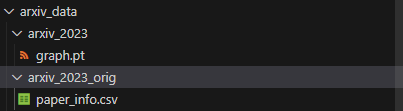

# LLM4LP

The code and datasets used are derived from the paper [*"Exploring the Potential of Large Language Models for Heterophilic Graphs"*](https://arxiv.org/abs/2408.14134), which is accepted by NAACL 2025. The code currently handles the dataset from the TAG4LP arxiv_2023 citation dataset. 

## Data

Each dataset in the `dataset` directory is in `.npz` format and includes:
`edges`, `node_labels`, `node_features`, `node_texts`, `label_texts`, `train_masks`, `val_masks`, `test_masks`, `hop3_train`, `hop3_val`, `hop3_test` masks.

## Experiments

### Stage1

1. Create a new environment using anaconda with the command-
    ```bash
    conda create -n llm4lp-env python=3.10 -y
    ```

2. Set up the environment following the `README.md` files in the `src/LLM` directories.
3. Install the requirements from the `requirements.txt` file
3. Install the torch geometric libraries from the `whl_files/` folder with the command-
    ```bash
    pip install whl_files/torch_scatter-2.1.2+pt23cu121-cp310-cp310-linux_x86_64.whl
    ``` 
    Similarly repeat for other files.
    

#### Finetune Vicuna 7B
1. Download the dataset from the [*TAG4LP DATASET*](`https://drive.google.com/file/d/15ZWzRESVpNFowt3zfm3v8-5DGdnMjFzk/view`).
2. Extract the `arxiv_data` like in suitable location in the directory. 

    
3. Execute the bash command-
   ```bash
       cd data_preparation
   ```
5. Generate the dataset of dense subgraph in `.npz` format by running the `prepare_arxiv_2023.py` file with the command -
    ```bash 
    python prepare_arxiv_2023.py     --output_npz_path ../dataset/arxiv_2023_v2.npz     --dataset_name arxiv_2023     --text_data_file_path ../arxiv_data/arxiv_2023_orig/paper_info.csv     --graph_data_file_path ../arxiv_data/arxiv_2023/graph.pt     --node_id_field node_id     --max_text_length 2048     --num_nodes_subgraph 2000     --negative_ratio 2.0     --num_long_range 300
    ```
    Change the paths as per your directory and preferences.
    Here, we select 2K sampled nodes and 300 long range edges. Also, for each positive edge we include 2 negative edges in the dataset.

6. Generate training, inference and long_range_training and long-range inference data using`generate_prompt_json.py` with the commmand-
    ```bash
    python generate_prompt_json.py --data_name Arxiv --mode llm_train --save_dir ../llm_pred/prompt_json/Arxiv --npz_path ../dataset/arxiv_2023.npz
    ```
    The various datasets you need to generate are - [llm_train, 1hop_val, 1hop_test, hop3_val, hop3_eval].
7. Repeat the above step for all the datasets and you should see a structure similar to this-
    

8. Fine-tune the Vicuna 7B model, merge it with any additional components, and then obtain the inference results for long-range edges:
    ```bash
    cd ../src/LLM
    bash train_lora_arxiv_slurm_job.sh
    python fastchat/model/apply_lora.py
    bash eval.sh 
    ```

### Stage2 - Rewiring and GNN training

1. Rewire the Graph by adding high probability edges inferred by the finetuned LLM by executing the `process_llm_probs.py` file. Run the following command.
    ```bash
    python process_llm_probs.py --result_path src/LLM/inference_results_lp_llm/long_range_edges/preds.json --save_dir src/GNN/llm_pred/rewired/ --threshold 0.7
    ```
    You can change the paths as per your directory structure for storing the inference and rewired graph.
2. Run the GNN by executing any of the training scripts with the commands-
    ```bash
    cd ../GNN/gnn_training_scripts/
    python gcn_link_predictor.py --npz_path ../../../dataset/updated_cora_v2.npz --dataset_name Cora
    ```
    You can also change the hyperparameters as per the file.
## Citation

```bash
@inproceedings{wu2025exploring,
title={Exploring the Potential of Large Language Models for Heterophilic Graphs},
author={Yuxia Wu and Shujie Li and Yuan Fang and Chuan Shi},
booktitle={The 2025 Annual Conference of the Nations of the Americas Chapter of the ACL},
year={2025}
}
```

